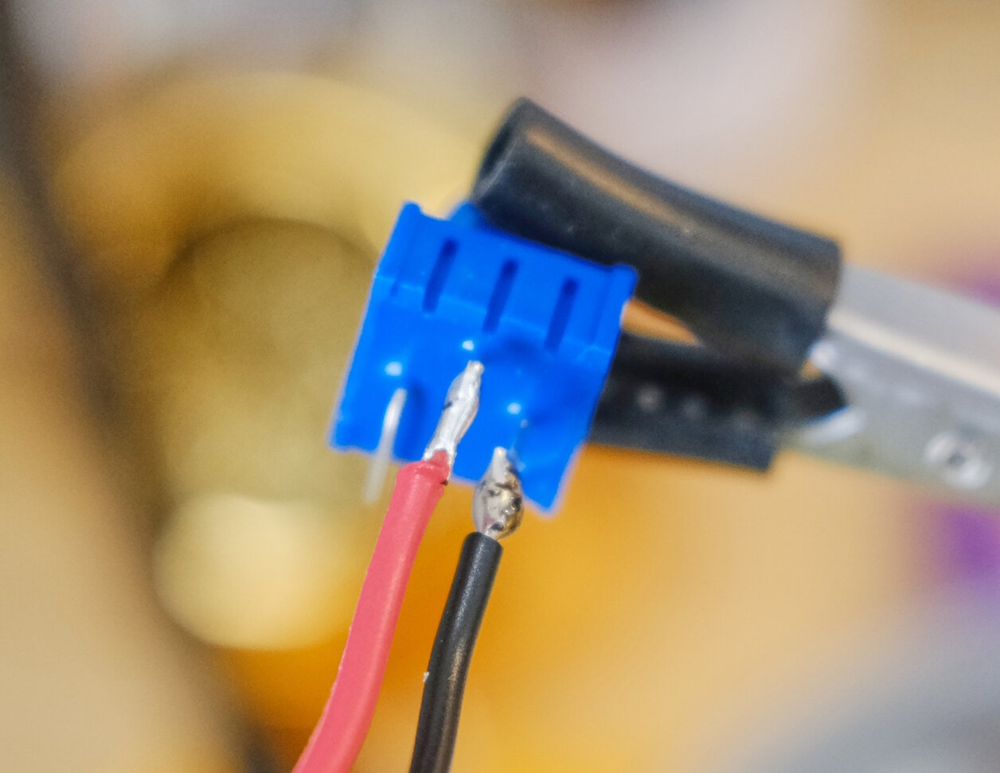

# MiniTV
A miniature TV based on the Simpsons TV by [Brandon Withrow](https://withrow.io/simpsons-tv-build-guide).

<p align="center">
<a href="https://www.youtube.com/watch?v=_eGjIswi3MQ" target="_blank"></a>
<p>

## Prerequisite Parts
* [Pi Zero](https://www.adafruit.com/product/2885) or [Pi Zero W](https://www.adafruit.com/product/3400)
* [Adafruit Mono 2.5 W Audio Amplifier](https://www.adafruit.com/product/2130)
* [1.5' 4ohm 3W Audio Speaker](https://www.adafruit.com/product/3968)
* SD Card (8GB or higher)
* [Micro USB DIP Breakout Board](https://www.amazon.co.uk/Breakout-Female-Socket-Adapter-Connector/dp/B07R9SMJKF)
* [Micro USB Male Cable](https://www.amazon.co.uk/Micro-Charger-Cable-Braided-Cables/dp/B08XQRV5W1)
* [1K Trim Potentiometer](https://www.amazon.co.uk/HELLOYEE-Breadboard-Trim-Potentiometer-Arduino/dp/B0777J1618)
* [Micro Push Button Switch](https://www.amazon.co.uk/gp/product/B00R1LI06W)
* Composite Screen [Use sudo mod wiki to figure which one you want to get and how to mod them to use 5V](https://www.sudomod.com/wiki/index.php/GBZ_Screen)
* (Optional)[Toggle Switch](https://www.amazon.co.uk/dp/B07RR7J2K6)
* (Optional)[Powerboost 500C](https://www.adafruit.com/product/1944)
* (Optional)[LiPo Battery 2200mAh](https://www.adafruit.com/product/1781)
* (Optional)[3D Printed Parts](/3Dfiles/)

## Prerequisite Videos encoding
Your videos must be encoded into the H264 format with a height of 480 pixel. this should not be done on the Pi for it would take a long time to get it done. 
A simple way of doing this first installing [FFMPEG](https://github.com/adaptlearning/adapt_authoring/wiki/Installing-FFmpeg) then copying the script [encode.py](/Code/videos/encode.py), collect all your videos in the same folder as the [encode.py](/Code/videos/encode.py) script, and running the python program. The script will loop through all of the video and encode them one by one, & the videos will be placed in a new sub folder called ‘encoded’. If you want to copy your videos via USB, you should move the encoded folder into a thumb drive. 

## Prepping SD Ready
1. Install the [Raspberry Pi Imager](https://www.raspberrypi.org/software/).
2. Insert SD Card.
3. Select you SD Card From "Storage" button.
4. From "Operating System" button navigate through "Raspberry Pi OS (Other)" and select "Raspberry Pi OS Lite (Legacy)".
5. A cog wheel now appears in the bottom right click on it and set the hostname to "raspberrypi", enable ssh and set the username as "pi" & the password as "raspberry".<br/><p align="center"><p>
6. If you're using a Pi Zero W then enable "Configure Wireless LAN" and add your Wifi's ssid and password.
7. __IMPORTANT: Double Check to Make Sure You Select The SD card.__ If you accidentally select, an external hard drive that is plugged into your computer, the next step will erase that hard drive. Once checked click on ‘Write’.
8. After the image is written to the SD card remount (Eject and re-insert) it to your computer.
9. Open the mounded device named "boot".
10. If you're using a pi Zero W, check if there is a file called "wpa_supplicant.conf" if not then make a file with that name and insert the following code (Replacing ssid and password with your wifi SSID and password):
    ```
    country=US
    ctrl_interface=DIR=/var/run/wpa_supplicant GROUP=netdev
    update_config=1

    network={
        ssid="NETWORK NAME"
        psk="NETWORK PASSWORD"
    }
    ```
11. Open the file "config.txt" using any text editor other that notepad and place at the bottom: 
```
dtoverlay=dwc2
dtparam=audio=on
dtoverlay=audremap,enable_jack,pins_18_19
disable_splash=1
```
12. Open the file "cmdline.txt" using any text editor and place the following after "rootwait": <br/>```modules-load=dwc2,g_ether```. This allows USB ethernet.
13. Find "console=tty3" & change it to "console=tty1". This sends the Login prompt to another nonexistant screen.
14. Find "fsck.repair=yes" and remove it. This stops forced Filesystem consistency checks after booting.
15. Add ```consoleblank=0 logo.nologo quiet splash``` to the very end of the line. This removes the text & Pi logos at the start of booting.
16. Create a file with the name "ssh" and without any file extension.
17. Save and Close any open files.

## TV Software Build
### Software Setup
1. Power on the pi by connecting it to the computer’s USB.
2. Launch putty, Command line or terminal and type: ```ssh pi@raspberrypi.local``` <br/>If that doesn’t work you'll have to figure out the Pi's IP and use ```ssh pi@[IP ADDRESS]``` or watch this video to try and [trouble shoot](https://youtu.be/aL1pWI2K60w?t=309).
3. If you're using a normal pi you'll need to [share your computer's internet with the Pi.](https://answers.microsoft.com/en-us/windows/forum/all/internet-connection-sharing-in-windows-10/f6dcac4b-5203-4c98-8cf2-dcac86d98fb9?auth=1)
4. Enter the password, ```type sudo raspi-config``` and change the default password.
5. Update the Pi with ```sudo apt-get update```.
6. Upgrade the Pi with ```sudo apt-get upgrade```.

### USB Mount 
7. If you want to copy the videos via the USB method then type ```sudo apt-get install usbmount``` otherwise skip to step 9.
8. We will now edit a file using the ```sudo nano /lib/systemd/system/systemd-udevd.service``` command.
9. Scroll down using the Down arrow key, and find the code "PrivateMounts=yes" and change that ***"yes"*** to a ***"no"***, then exit using **CTRL+X** and the pressing **Y**.

### Omxplayer
10. Next we will be installing omxplayer, but before that we need to install git using ```sudo apt-get install git```.
11. Since Omxplayer cannot be installed with apt-get anymore, we will be using a legacy version. start by going into the main directory using ```cd ~```.
12. Download the archived omxplayer Debian file with ```wget http://archive.raspberrypi.org/debian/pool/main/o/omxplayer/omxplayer_20190723+gitf543a0d-1_armhf.deb```.
13. Install the .deb file with ```sudo dpkg -i omxplayer_20190723+gitf543a0d-1_armhf.deb```.
14. Then install the dependencies ```sudo apt-get -f install```.
15. Lastly delete the omxplayer .deb file with ```rm omxplayer_20190723+gitf543a0d-1_armhf.deb```.
16. Test if omxplayer is properly installed with ```omxplayer```, to get out of omxplayer type **CTRL+C**.

### Clone Repository
17. To the GitHub repository to the Pi use ```git clone https://github.com/SaifSabban/MiniTV```.

### Add a Splash Screen
18. Install the Linux framebuffer image viewer with ```sudo apt install fbi```.
19. Create our splash screen command file using ```sudo nano /lib/systemd/system/splashscreen.service```.
20. Copy and paste the following into the editor, changing the splash screen to the one you want to use:
```
[Unit]
Description=Splash screen
DefaultDependencies=no
After=local-fs.target

[Service]
ExecStart=/usr/bin/fbi -d /dev/fb0 --noverbose -a /home/pi/MiniTv/Extra/SplashScreens/NTSCTestCard.png
StandardInput=tty
StandardOutput=tty

[Install]
WantedBy=sysinit.target
```
21. Update your Pi with ```sudo apt-get update``` then enable the splash screen with ```sudo systemctl enable splashscreen```

### Moving Videos (USB Method)
22. go to the videos directory ```cd ~/MiniTv/videos```.
23. Plug in the USB and type on the command line ```sudo cp -R /media/usb/encoded/. ~/MiniTv/videos```.

### Moving Videos (SSH Method)
24. Move the video files to a folder called "videos".
25. On you computer's command terminal type in ```scp -r C:/Users/[DIRECTORY]}/videos pi@raspberrypi.local:/home/pi/MiniTv```<br/> replacing **[DIRECTORY]** with your actual directory.
26. You will be asked to if you want to save the device's hash, type "YES".
27. Enter your Pi's password. and wait for the transfer to finish.

### Setting Start-up Sequence
28. Create and edit the start up file for the buttons program by first typing<br/>```sudo touch /etc/systemd/system/tvbutton.service```<br/>then<br/>```sudo nano /etc/systemd/system/tvbutton.service```.
29. Copy and paste the following into the editor:
```
[Unit]
Description=tvbutton
After=network.target

[Service]
WorkingDirectory=/home/pi/MiniTv/
ExecStart=/usr/bin/python /home/pi/MiniTv/buttons.py
Restart=always

[Install]
WantedBy=multi-user.target
```
30. Create and edit the start up file for the buttons program by first typing<br/>```sudo touch /etc/systemd/system/tvplayer.service```<br/>then<br/>```sudo nano /etc/systemd/system/tvplayer.service```.
31. Copy and paste the following into the editor:
```
[Unit]
Description=tvplayer
After=network.target

[Service]
WorkingDirectory=/home/pi/MiniTv/
ExecStart=/usr/bin/python /home/pi/MiniTv/player.py
Restart=always

[Install]
WantedBy=multi-user.target
```
32. Finally, type in ```sudo systemctl enable tvbutton.service``` then ```sudo systemctl enable tvplayer.service``` to have the two begin at start up.
33. Shutdown the Pi with ```sudo shutdown -h now``` and build the rest of the TV. 

## TV Physical Build
### Screen Circuit
1. These composite screens usually have 4 pins which correspond to Power, GND, AV1 & AV2
2. These screens are expecting 12V power. Some screens work with both 12V and 5V, but if they don't then follow the guide from this wiki to [convert your screen](https://www.sudomod.com/wiki/index.php/GBZ_Screen)
3. Remove the current wires and connect wires to Power, GND, & AV1 (Preferably with the colours red, black & white, respectively).

### Screen Button Circuit
4. Solder a wire to the middle right pin of the button, and another to the bottom right pin. Orientation of the button doesn't matter.<br/><p align="center"><p>

### Audio Circuit
5. Solder a Wire to pin A+ on the mono amplifier, and another 2 to ground and V+.<br/><p align="center"><p>
6. Connect A- to Ground.<br/><p align="center"><p>
7. Solder a wire to the center of the potentiometer, and another to the right side. <br/><p align="center"><p>
8. Connect on wire from the potentiometer to the speaker, the other to the amplifier, and solder a wire from the remaining pin from the speaker to the amp.<br/><p align="center"><p>

### Connecting Circuit to Pi
9. Solder the circuits to the appropriate pins:
    1) Screen PCB = 5V, GND, Pin TV
    2) Screen Button = Gnd & pin 26
    3) Audio Circuit = 5V, GND & pin 19
<br/><p align="center"><p>

# This would be a good time to test your circuit!
### Power Circuit
10. If you want to opt not to have your TV battery powered, then Solder the appropriate wires from the USB cable to the Micro USB dip board, and skip to assembly. Other wise go the next step.<br/><p align="center"><p>

### Battery Circuit
11. If you've decided to have a battery in the system, then perfom the following:
    *Solder the Data wire of your USB cables to the Micro USB dip board.
    *The GND wire from the Micro USB cable to any GND pin on the powerboost, and the 5V wire to the 5V pin.
    *Solder one pin from the toggle switch to the EN pin of the power boost, and the other switch poin to any GND pin.
    *Solder the GND pin from the Micro USB dip board to any GND pin on the powerboost, and the 5V pin on the USB board to the USB pin on the powerboost.
    *Plug the Battery to the JST connector, making sure the pins are in the correct order.
<br/><p align="center"><p>

## Assembly
This section is still under development, for now you can follow the rest of the guide from [Brandon Withrow's guide](https://withrow.io/simpsons-tv-build-guide).
